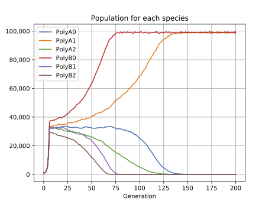

# Autómata Evolutivo 5
<i>Evolutionary automaton</i> 2015--2024

 - Javier Falgueras
 - Carlos Villagrasa, originally
 - Juan Falgueras
 - Andrés Moya

This program is to be executed on a UNIX/Linux Terminal. It uses
Python 3 and a few standard python libraries.

### For Windows:

If you use a modern Windows, you need to install Python which is not pre-installed.  You can do that using this (links can be different for more modern versions)
[link https://www.python.org/ftp/python/3.10.5/python-3.10.5-amd64.exe](https://www.python.org/ftp/python/3.10.5/python-3.10.5-amd64.exe)

If you have an old Windows, perhaps you would need to see which one could suit your version:
[link https://www.python.org/downloads/windows/](https://www.python.org/downloads/windows/)

You have many videos explaining the process [like this one](https://www.youtube.com/watch?v=Kn1HF3oD19c)

The Terminal command on Windows can be the simple `command.com` you can find it through the "Start" button and searching for `Command Prompt`

<!-- On Windows there is not a default Terminal, but it is easy to install one See footnote [1](#f1).
 -->

### On MacOSX/Linux

Search for the application terminal and check that `python3` works there.

### Installing AE5

Once Terminal + Python are ready, continue installing our AE5:

First of all you have to download the directory with the program using
 [the repository https://github.com/juanfal/AE5](https://github.com/juanfal/AE5)

 The simplest way is to Use the Green Button-Menu -> Download Zip

 Then decompress the .zip file and execute your Terminal aplication on your
 computer, once the window of your Terminal is prompting you for a command,
change to the fresh uncompressed directory where `ae5.py` is.

    cd ...../AE5 

the dots depend on the place you decompressed the downloaded .zip file

There you can execute it by:

    python3 ae5.py

First thing you need to try is:

    python3 ae5.py --help

## Python libraries AE5 needs

If you don't have some of the required standard libraries it needs, you'll be
asked for them just in the first execution.  The program will show you the
standard command to install it.

The next libraries have to be installed

    matplotlib 
    xlsxwriter

It is possible to repeat the installation of libraries already installed, 
so if you had any of them but want to ensure you have all the needed ones,
execute each of the following commands:

    pip3 install matplotlib
    pip3 install xlsxwriter

To follow the examples described in the Articles this program is made for:

Once the program is installed and running, to try each of the examples you can
use the name of the file in `data` (no need to use the name of the `data`
directory) like: `Paper2/2Plank1.json` or `Paper3/QDinAsoc3.json`

Or you can add specific parameters like the ones in the Article this program is
the base for.  In this case the parameters for each case can be
copy–pasted into the Terminal from the table “Terminal Command or Rank:” found
in the Supplementary Material.

For example, for the 'Paradox of the plankton' one of the examples is:

    python3 ae5.py Paper1/1Plank4 --numGen=200 --saveExcel --setRandomSeed=1 --verbose

Málaga, 2021-05-25

[<b id="f1">1</b> [↩](#a1)] With Windows, you can use
[Windows Terminal](https://www.microsoft.com/en-us/p/windows-terminal/9n0dx20hk701?activetab=pivot:overviewtab). To install python3 on Windows, you can
go to [Get started using Python on Windows for beginners](https://docs.microsoft.com/en-us/windows/python/beginners)